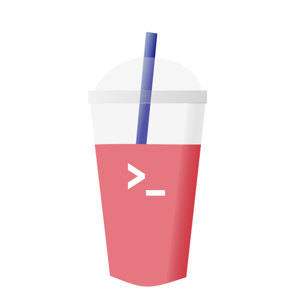

## Slush goals & objectives
Slush is not planned to be a useful interactive shell, but instead a lightweight POSIX-compliant shell inspired by Dash. Below
is a list of objectives for the near term. The to-do list is always growing as I learn more about what goes into a POSIX shell. 

## Todo
- [x] Subshell
  - [x] Backtick subshell
  - [x] Dollar sign subshell
- [x] Pipelines
  - [x] better pipelines that don't require EOF 
- [ ] Expansions
  - [x] Brace expansions
  - [x] Parameter Expansion
  - [ ] Tilde Expansion
  - [ ] Pathname Expansion
- [x] Basic single quote strings
- [ ] Double quote strings with substitutions
- [x] [File redirects](https://pubs.opengroup.org/onlinepubs/9699919799/utilities/V3_chap02.html#tag_18_07)
- [x] Redirect input with `<`
- [ ] Explicit file descriptor redirects
- [ ] [String Splitting](https://www.shellcheck.net/wiki/SC2086)
- [ ] Globbing
- [ ] Environment handling
  - [x] Calling variables
  - [x] Assigning Variables
  - [ ] Special Parameters
    - [x] previous exit status
    - [ ] Positional params
    - [x] PID of subshell
    - [ ] PID of most recent background
    - [x] Name and shell startups 
- [ ] Control Flow
  - [x] if
  - [x] elif
  - [x] else
  - [x] while
  - [x] until
  - [ ] for
- [x] Lists
  - [x] And-if (`||`)
  - [x] Or-if (`&&`)
- [ ] Background process control
  - [x] Moving jobs to the background
  - [ ] bringing jobs to the foreground
  - [x] listing available jobs
- [ ] essential built-ins
  - [ ] [list of posix built ins at the bottom](https://pubs.opengroup.org/onlinepubs/9699919799/utilities/V3_chap01.html)
  - [x] cd
  - [x] exit
  - [x] true/false
  - [ ] alias
- [x] ctrl-c to kill jobs
  - [x] fix bug where ctrl-c on a job that modifies TTY state utterly breaks the terminal (for example less)
  - [x] fix bug where ctrl-c kills bg jobs as well
  - [ ] Use libc calls directly (no ctrl-c rs crate)
  - [x] jobs in array aren't removed when child ends
- [x] Path cleaning w/ out clean-path library
- [ ] Built in functions
